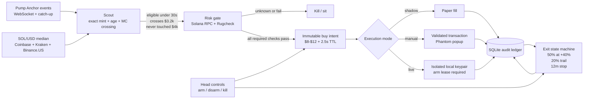

# Solid Octo Engine

A fail-closed, exact-mint execution desk for very early pump.fun launches. The fast path is deterministic: Bots can explain, research, and report, but they cannot choose the mint, override risk, sign transactions, or claim fills.

This is experimental trading software. It does not make the strategy profitable and it cannot make new tokens safe. Start in `shadow`, reconcile every result, and assume every dollar in a live execution wallet can be lost.



## What is deterministic

- Native Pump `createEvent` and `tradeEvent` subscriptions, slot heartbeat, durable checkpoint, and bounded catch-up.
- Exact mint identity. Names and symbols are display-only, so same-name remints remain separate candidates.
- Bonding-curve market-cap computation and a strict crossing rule: below `$3,200` on the previous event, at or above it now, age at most 30 seconds, and high-water market cap still below `$4,000`.
- Median SOL/USD mark with staleness, source-count, and spread gates. Dexscreener is not in the entry path.
- On-chain mint/freeze authority, token program, canonical Pump curve owner/PDA, holder concentration, creator holdings, Rugcheck availability, and insiders. Any required unknown is a kill.
- One immutable buy intent per mint, short intent expiry, bounded spend, daily cap, position cap, wallet binding, risk/policy hashes, transaction simulation, and program allowlisting.
- Durable SQLite ledger in WAL/FULL mode for candidates, risk reports, intents, executions, positions, control state, and the event stream.
- Exit state machine: sell half at `+40%`, trail the remainder by `20%`, close at 12 minutes, and allow emergency exits even while new buys are disarmed.

## Quick start

Requirements: Node.js 24 or newer and npm. The current official Pump SDK/Anchor ESM bundle is not compatible with Node 22's CommonJS named-export behavior.

```bash
npm ci
cp .env.example .env
npm run check
npm run build
npm run replay -- fixtures/vsexy-replay.json
npm start
```

Open [http://127.0.0.1:8787](http://127.0.0.1:8787). The default mode is `shadow` and cannot send transactions.

Use authenticated private Solana HTTP/WebSocket endpoints for continuous operation. The public endpoints are only safe defaults for setup and will rate-limit or stall.

## Configure a private Solana RPC

A private RPC is an authenticated gateway to Solana; it is not a wallet and cannot move funds by itself. The provider does not need—and must never receive—your Phantom password, recovery phrase, or execution-wallet keypair.

Keep the desk disarmed while changing RPC configuration. The simplest setup is [Helius](https://dashboard.helius.dev/):

1. Create a Helius account and project, then create an API key in the dashboard.
2. Use **mainnet**, not devnet.
3. Put the matching HTTP and WebSocket endpoints in the local `.env` file:

   ```dotenv
   SOLANA_RPC_HTTP_URL=https://mainnet.helius-rpc.com/?api-key=YOUR_API_KEY
   SOLANA_RPC_WS_URL=wss://mainnet.helius-rpc.com/?api-key=YOUR_API_KEY
   ```

   These are the documented Helius [HTTP authentication](https://www.helius.dev/docs/api-reference/authentication) and [WebSocket](https://www.helius.dev/docs/rpc/websocket/quickstart) formats.

[QuickNode](https://www.quicknode.com/docs/solana/quickstart) is an alternative: create a Solana `mainnet-beta` endpoint and copy both provider URLs from its dashboard. A QuickNode pair normally resembles:

```dotenv
SOLANA_RPC_HTTP_URL=https://YOUR_ENDPOINT.solana-mainnet.quiknode.pro/YOUR_TOKEN/
SOLANA_RPC_WS_URL=wss://YOUR_ENDPOINT.solana-mainnet.quiknode.pro/YOUR_TOKEN/
```

Treat either pair as secrets because the URLs contain billable credentials. Keep them out of chat, Bot prompts, screenshots, shell output, commits, and browser-delivered client code. `.env` is ignored by Git. If a Grok connected-service card says the value is stored securely and never shown to the Bot, its secret field can hold the HTTP URL; add the WebSocket URL as a separate `SOLANA_RPC_WS_URL` secret. Do not paste either value into an ordinary Grok conversation.

### Validate before live use

Restart with `DESK_MODE=shadow`, then verify the dashboard and [`/api/health`](http://127.0.0.1:8787/api/health). Do not arm live until a forward run shows all of the following:

- The event stream stays healthy and receives fresh slots.
- The price oracle stays healthy.
- Real candidate risk reports complete successfully, including `getTokenLargestAccounts`; no required field is `unknown`.
- There are no recurring RPC `403`, `429`, timeout, or WebSocket disconnect errors.
- Risk checks finish inside the configured deadline under normal candidate load.
- The engine remains fail-closed when the RPC is deliberately made unavailable.

If public-RPC errors disappear but the private endpoint still rate-limits or misses the risk deadline, raise the provider capacity or choose a lower-latency plan/region. Do not bypass holder checks, increase risk, or relax the fail-closed policy merely to make the health indicator pass.

## Execution modes

| Mode     | Signer                                    |                               Can spend SOL? | Intended use                                      |
| -------- | ----------------------------------------- | -------------------------------------------: | ------------------------------------------------- |
| `shadow` | None                                      |                                           No | Replay, forward paper run, reconciliation         |
| `manual` | Injected Phantom in the local dashboard   | Only after the user approves the exact popup | Existing Phantom wallet without exporting secrets |
| `live`   | Dedicated local keypair file, mode `0600` |                Only during a valid arm lease | Bounded automation after shadow/manual validation |

For manual mode, set `DESK_MODE=manual` and `EXPECTED_SIGNER_PUBLIC_KEY` to the exact Phantom address. Unlock Phantom yourself; the dashboard requests the injected provider and verifies the connected address. It never accepts a password or recovery phrase.

For live mode, do **not** export the keypair or phrase of a personal Phantom wallet. Create a separate wallet with no mnemonic, fund it from Phantom with only the small amount you accept losing, and keep the file outside the repository:

```bash
mkdir -p "$HOME/.config/solid-octo-engine"
npm run wallet:create -- "$HOME/.config/solid-octo-engine/execution-wallet.json"
```

Then set `SOLANA_EXECUTION_KEYPAIR_PATH`, `EXPECTED_SIGNER_PUBLIC_KEY`, and a random `DESK_ARM_TOKEN` of at least 24 characters. The engine verifies file permissions and exact address equality before startup. See [docs/OPERATIONS.md](docs/OPERATIONS.md).

## Bot roles

Bot prompts live in [`bots/`](bots/). Recommended conversational Bots are Head of Desk, Search, Shill, and Finance. Scout, Sniper, Risk, Whale, Rug, and Exit are engine-owned deterministic roles; their prompts are for read-only explanation/monitoring only.

All prompts inherit [`bots/COMMON_BOUNDARIES.md`](bots/COMMON_BOUNDARIES.md): no wallet secrets, no arbitrary signing or transfers, no overrides of a deterministic `SIT`, and no fill claims without a ledger record and confirmed signature.

## Repository map

- `src/adapters/` — Pump event stream and price oracle
- `src/core/` — candidate, policy, control, health, and exit state machines
- `src/risk/` — on-chain and Rugcheck risk snapshot
- `src/execution/` — transaction builder, guard, and three executors
- `src/storage/` — SQLite audit ledger
- `src/api/` and `apps/dashboard/` — local API, SSE stream, controls, manual Phantom bridge, and UI
- `fixtures/` and `tests/` — VSEXY crossing replay, QUEEZING remint replay, and invariant tests
- `bots/` — bounded role prompts
- `deploy/` — container and systemd examples

Read [docs/ARCHITECTURE.md](docs/ARCHITECTURE.md), [SECURITY.md](SECURITY.md), and [docs/DEPENDENCIES.md](docs/DEPENDENCIES.md) before live use.

## Live-readiness gate

Do not switch to `live` merely because the service starts. Require a forward shadow run with zero duplicate intents, no stale-oracle entries, measured event-to-intent latency inside the opportunity window, expected/actual fill reconciliation, tested kill/exit paths, and a loss budget you are willing to lose completely.
