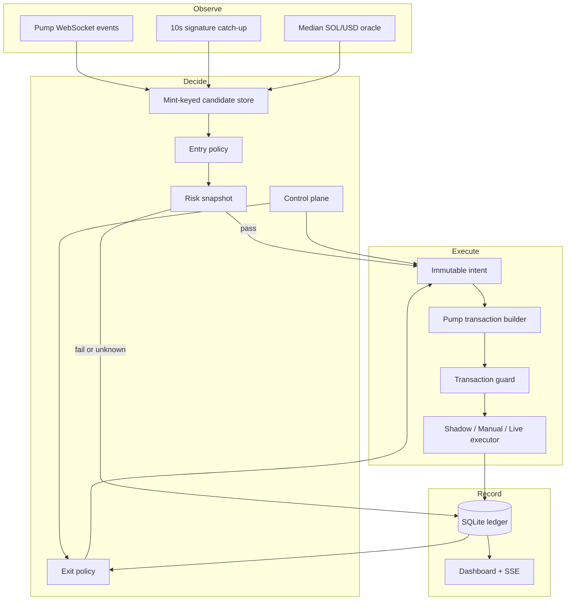
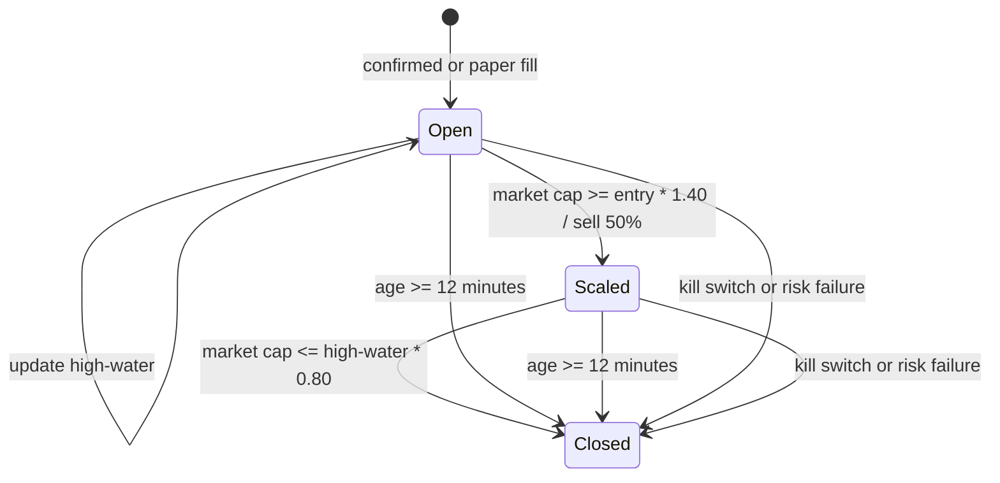

# Architecture and invariants

## Entry invariants

The entry decision is a pure function of a mint-keyed state, price mark, policy, and timestamp. The default decision requires all of the following:

1. The mint is at most 30 seconds old by its on-chain event timestamp.
2. Its previous computed market cap is below $3,200.
3. Its current computed market cap is at least $3,200.
4. Its high-water market cap has never reached $4,000.
5. The SOL/USD mark is at most five seconds old, has at least two healthy sources, and its spread is at most 1%.
6. The mint has no prior buy intent in the ledger.
7. The bounded risk snapshot completes before its deadline and every required check passes.
8. Spend and position limits permit the intent.

Name and symbol do not participate in identity. `one_buy_per_mint_idx` makes a second buy intent for the same mint impossible even after restart. A remint with the same name has a different address and is evaluated independently.

## Risk semantics

Before Pump graduation there is no conventional AMM LP position to lock; liquidity is held by the canonical Pump bonding-curve program. Therefore the early-launch deterministic equivalent is an exact canonical bonding-curve PDA and owner check. Rugcheck remains a required independent availability/insider source by default. After graduation this version does not open a new position, because the requested entry window is pre-graduation.

Risk inputs are hashed into the order intent. `unknown` is not a soft warning: any required unknown makes `passed=false`. Open positions are rechecked every 15 seconds; a failure, error, or timeout engages the kill switch and requests a full exit.

## Execution invariants

- An intent is immutable, wallet-bound, mint-bound, policy-hash-bound, risk-hash-bound, and expires quickly.
- A buy is impossible in live mode without a valid arm lease; a sell remains possible so the arm gate cannot trap an emergency exit.
- The transaction returned by the builder is untrusted input and is inspected before signing.
- A live transaction is simulated with signature verification before broadcast.
- Manual mode does not mark a fill from the popup response alone; it validates the fetched confirmed transaction.
- Dashboard state comes from the ledger, not Bot messages.

## Exit state

The SQLite record is the source of truth. Failed exit submission returns the position to `open` and emits an auditable failure; it never fabricates a close.

## Recovery behavior

Candidate state, the event checkpoint, controls, intents, executions, and positions survive restart. The live event source installs listeners before catch-up, replays up to 100 Pump signatures newer than the durable checkpoint, and relies on signature/slot deduplication to absorb overlap. If the slot heartbeat is absent for 15 seconds, health is marked down and live mode engages the kill switch.
