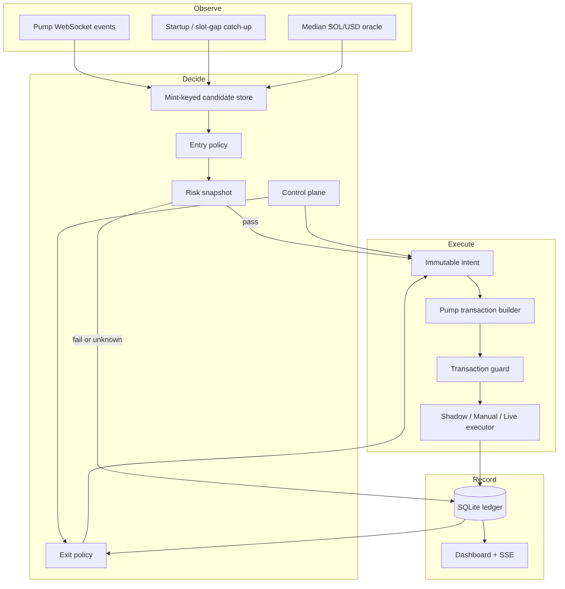
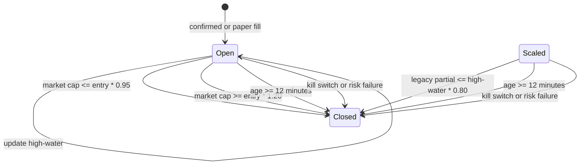

# Architecture and invariants

## Entry invariants

The entry decision is a pure function of a mint-keyed state, price mark, policy, and timestamp. The default decision requires all of the following:

1. The mint is at most 30 seconds old by its on-chain event timestamp.
2. Its previous computed market cap is below $3,200.
3. Its current computed market cap is at least $3,200.
4. Its high-water market cap has never reached $4,000.
5. The SOL/USD mark is at most five seconds old, has at least two healthy sources, and its spread is at most 1%.
6. The mint has no prior buy intent in the ledger.
7. The bounded risk snapshot completes before its deadline and every required check passes.
8. Spend and position limits permit the intent.

Name and symbol do not participate in identity. `one_buy_per_mint_idx` makes a second buy intent for the same mint impossible even after restart. A remint with the same name has a different address and is evaluated independently.

## Risk semantics

Before Pump graduation there is no conventional AMM LP position to lock; liquidity is held by the canonical Pump bonding-curve program. Therefore the early-launch deterministic equivalent is an exact canonical bonding-curve PDA and owner check. Rugcheck remains a required independent availability/insider source by default. After graduation this version does not open a new position, because the requested entry window is pre-graduation.

Risk inputs and bounded raw evidence are hashed into the order intent. `unknown` is not a soft warning at entry: any required unknown makes `passed=false`. Classic SPL Token snapshots use three concurrent calls: a batched mint/curve account read, largest token accounts, and creator-owned token accounts. Token-2022 does not support `getTokenLargestAccounts`, so its snapshot instead combines the batched mint/curve read with a mint-filtered token-program scan. The scan returns only each account's owner and raw amount, has no fixed-size filter so Token-2022 extensions remain valid, and derives both curve-excluded concentration checks from the same slot-bounded account set. Helius uses `getProgramAccountsV2`; other providers use standard `getProgramAccounts`. A Helius response requiring another page fails closed because separately evaluated pages cannot prove one consistent holder snapshot. Fresh-index retries are bounded to twice by default. Rugcheck summary and insider-network endpoints run concurrently with the on-chain snapshot. Only one entry or position risk snapshot owns the gate at a time.

Open positions are normally rechecked every 15 seconds with a separate three-second deadline. A confirmed hard failure—authority, program, canonical curve, holder concentration, or insider evidence—engages the kill switch and requests a full exit immediately. A provider error, timeout, `unknown`, or otherwise unclassified failed report first disarms new buys, marks Risk degraded, and retries after two seconds. Two consecutive uncertain checks engage the kill switch. A passing check resets the counter. This preserves fail-closed behavior without turning one transient Rugcheck timeout into false rug evidence.

## Execution invariants

- An intent is immutable, wallet-bound, mint-bound, policy-hash-bound, risk-hash-bound, and expires quickly.
- A buy is impossible in any mode while KILL is engaged. Live buys additionally require a valid arm lease; a sell remains possible so neither gate can trap an emergency exit. Entry checks KILL before Risk and again after Risk to close the race window.
- The transaction returned by the builder is untrusted input and is inspected before signing.
- A live transaction is simulated with signature verification before broadcast.
- Pump simulation errors `6002` (`TooMuchSolRequired`) and `6003` (`TooLittleSolReceived`) are pre-broadcast slippage rejections, not fills. A rejected buy is terminal for that exact candidate and disarms further buys, but does not require a process restart.
- Manual mode does not mark a fill from the popup response alone; it validates the fetched confirmed transaction.
- Dashboard state comes from the ledger, not Bot messages.
- Portfolio accounting records confirmed native/token deltas and fees when available, estimates open value from the bonding-curve market cap, and writes mode- and wallet-scoped 30-second marks. Pre-schema positions remain explicitly unvalued instead of receiving fabricated P&L.

## Exit state

The SQLite record is the source of truth. Every exit attempt gets a fresh immutable intent, a 10-second TTL, and the same configured slippage ceiling; the engine never widens slippage between attempts. A pre-broadcast build/simulation failure may retry up to three times, then returns the position to `open` for a two-second cooldown and continued monitoring. Once broadcast may have occurred, automatic retries stop to prevent a duplicate sell: the position stays `closing`, the kill switch engages, and a human must reconcile the signature/balances. No failure path fabricates a close.

## Recovery behavior

Candidate state, the event checkpoint, controls, intents, executions, and positions survive restart. Interrupted nonterminal candidates become terminal kills on restart. The live event source installs one log listener before catch-up, replays up to 100 Pump signatures newer than the durable checkpoint, ignores failed transactions, and preserves the newest live checkpoint even if older catch-up work is slower. Events are serialized per mint so asynchronous oracle/risk work cannot reorder one mint's state. If the slot heartbeat is absent for 15 seconds, health is marked down and live mode engages the kill switch.
